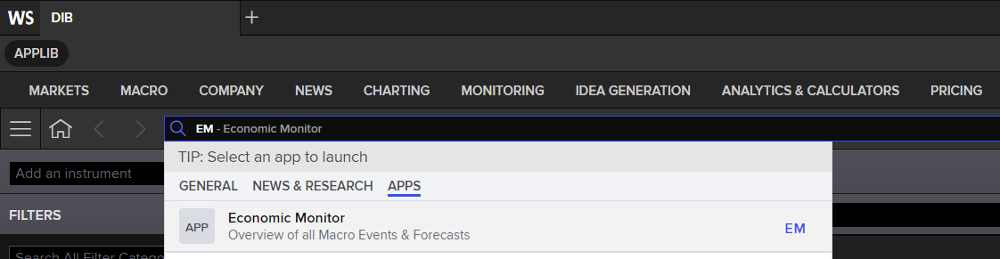
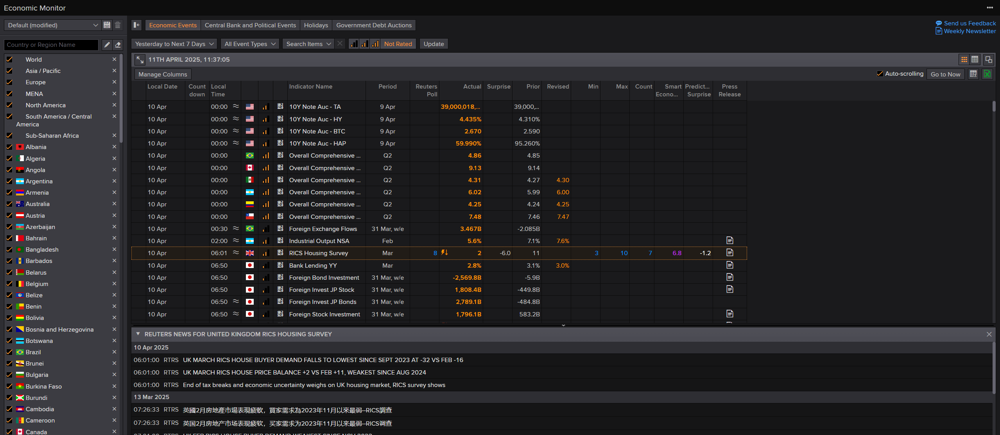
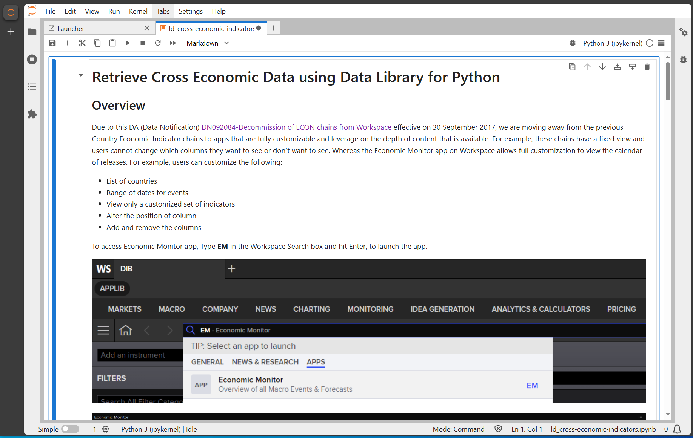

# Retrieve Cross Economic Data using Data Library for Python
- Last update: April 2025
- Environment: Windows 
- Compiler: Python 
- Prerequisite: LSEG Workspace desktop application with access to Data Library.

## Overview

Due to this DA (Data Notification) [DN092084-Decommission of ECON chains from Workspace](https://myaccount.lseg.com/en/datanotification/DN092084) effective on 30 September 2017, we are moving away from the previous Country Economic Indicator chains to apps that are fully customizable and leverage on the depth of content that is available. For example, these chains have a fixed view and users cannot change which columns they want to see or don’t want to see. Whereas the Economic Monitor app on Workspace allows full customization to view the calendar of releases. For example, users can customize the following:

- List of countries
- Range of dates for events
- View only a customized set of indicators
- Alter the position of column
- Add and remove the columns

To access Economic Monitor app, Type **EM** in the Workspace Search box and hit Enter, to launch the app.

 



## <a id="rdp_lib"></a>Introduction to the Data Library for Python

The [Data Library for Python](https://developers.lseg.com/en/api-catalog/lseg-data-platform/lseg-data-library-for-python) provides a set of ease-of-use interfaces offering coders uniform access to the breadth and depth of financial data and services available on the Workspace, RDP, and Real-Time Platforms. The API is designed to provide consistent access through multiple access channels and target both Professional Developers and Financial Coders. Developers can choose to access content from the desktop, through their deployed streaming services, or directly to the cloud. With the Data Library, the same Python code can be used to retrieve data regardless of which access point you choose to connect to the platform.

 

The Data Library are available in the following programming languages:

- [Python](https://developers.lseg.com/en/api-catalog/lseg-data-platform/lseg-data-library-for-python)
- [.NET](https://developers.lseg.com/en/api-catalog/lseg-data-platform/lseg-data-library-for-net)
- [TypeScript](https://developers.lseg.com/en/api-catalog/refinitiv-data-platform/refinitiv-data-library-for-typescript)

For more deep detail regarding the Data Library for Python, please refer to the following articles and tutorials:

- [Quickstart](https://developers.lseg.com/en/api-catalog/lseg-data-platform/lseg-data-library-for-python/quick-start).
- [Documentation](https://developers.lseg.com/en/api-catalog/lseg-data-platform/lseg-data-library-for-python/documentation).
- [Tutorials](https://developers.lseg.com/en/api-catalog/lseg-data-platform/lseg-data-library-for-python/tutorials).
- [GitHub](https://github.com/LSEG-API-Samples/Example.DataLibrary.Python).

### Disclaimer

This project is based on Data Library Python versions **2.1.1** using the Desktop Session only.

## <a id="prerequisite"></a>Prerequisite
This example requires the following dependencies softwares and libraries.
1. LSEG Workspace desktop application with access to Data Library for Python.
2. [Python](https://www.python.org/) ([Ananconda](https://www.anaconda.com/distribution/) or [MiniConda](https://docs.conda.io/en/latest/miniconda.html) distribution/package manager also compatible).
3. [Jupyter Lab](https://jupyter.org/) application.

*Note:* 
- This Project has been qualified with Python version 3.11.5
- If you are not familiar with Jupyter Lab application, the following [tutorial](https://www.datacamp.com/tutorial/tutorial-jupyter-notebook) created by DataCamp may help you.

## <a id="eikon_setup"></a>Data Library with Desktop Session Set Up

Please follow a step by step guide to setup your library and App-Key in "Desktop - Eikon or LSEG Workspace" of [LSEG Data Library for Python Quick Start page](https://developers.lseg.com/en/api-catalog/lseg-data-platform/lseg-data-library-for-python/quick-start) . 

## <a id="running"></a>How to run this example

Please note that the Workspace desktop application integrates a Data API proxy that acts as an interface between the Python library and the Workspace Platform. For this reason, the Workspace application must be running when you use the Data library.

The first step is unzip or download the example project folder into a directory of your choice, then choose how to run application based on your environment below.

### Running the Notebook example.

1. Open a Command Prompt and go to project's folder
2. Run the following command in a Command Prompt to create a Python virtual environment named *econ* for the project.

    ```bash
    $>python -m venv econ
    ```

3. Once the environment is created, activate a virtual environment named ```econ``` with this command in a Command Prompt

    ```bash
    $>econ\Scripts\activate
    ```

4. Go to project's notebook folder and update a contain in ```lseg-data.config.json``` file with the your App-Key

    ```json
    {
        "logs": {
            "level": "debug",
            "transports": {
                "console": {
                    "enabled": false
                },
                "file": {
                    "enabled": false,
                    "name": "lseg-data-lib.log"
                }
            }
        },
        "sessions": {
            "default": "desktop.workspace",
            "desktop": {
                "workspace": {
                    "app-key": "YOUR APP KEY GOES HERE!"
                }
            }
        }
    }
    ```

5. Run the following command in a Command Prompt to install the project dependencies

    ```bash
    $>(econ) pip install -r requirements.txt
    ```

6. In the current Command Prompt, go to project's notebook folder. Run the following command to start Jupyter Lab in the notebook folder.

    ```bash
    $>(econ)>notebook>jupyter lab
    ```

7. Open *ld_cross-economic-indicators.ipynb* Notebook document, then follow through each notebook cell.

     

**Note**: If you are using AnaConda/MiniConda, please refer to this [Conda - Managing environments document](https://docs.conda.io/projects/conda/en/stable/user-guide/tasks/manage-environments.html) for more detail about how create and activate environment with Conda.

## <a id="references"></a>References

You can find more detail regarding the Data Library and related technologies for this Notebook from the following resources:

- [LSEG Data Library for Python](https://developers.lseg.com/en/api-catalog/lseg-data-platform/lseg-data-library-for-python) on the [LSEG Developer Community](https://developers.lseg.com/)
- [Data Library for Python - Reference Guide](https://developers.lseg.com/en/api-catalog/lseg-data-platform/lseg-data-library-for-python/documentation#reference-guide)
- [The Data Library for Python  - Quick Reference Guide (Access layer)](https://developers.lseg.com/en/article-catalog/article/the-data-library-for-python-quick-reference-guide-access-layer) article.
- [Essential Guide to the Data Libraries - Generations of Python library (EDAPI, RDP, RD, LD)](https://developers.lseg.com/en/article-catalog/article/essential-guide-to-the-data-libraries) article.
- [Upgrade from using Eikon Data API to the Data library](https://developers.lseg.com/en/article-catalog/article/Upgrade-from-using-Eikon-Data-API-to-the-Data-library) article.
- [Data Library for Python Examples on GitHub](https://github.com/LSEG-API-Samples/Example.DataLibrary.Python) repository.


For any question related to this example or Data Library, please use the Developers Community [Q&A Forum](https://community.developers.refinitiv.com).